# cfx跨空间操作方案

为了方便用户在espace使用cfx，专门开发了cfx跨空间调用接口，用户可以方便的使用该方案实现：

- 将Conflux网络中的原生cfx跨入espace，将cusdt跨入espace，形成espace下的usdt。

- 将espace中的ecfx（为方便，不严谨的称其为ecfx）转账跨回Conflux网络，espace下的usdt转账跨回Conflux网络。

## CFX跨空间DAPP

- [Fluent transfer dapp](https://evm.fluentwallet.com/)：提供cfx，cusdt，ceth等代币跨入espace空间，或将cfx，usdt，eth从espace跨入cspace功能

- [Conflux hub](https://confluxhub.io/espace-bridge/cross-space)：提供cfx，cusdt，ceth等代币跨入espace空间，或将cfx，usdt，eth从espace跨入cspace功能，提供BSC cfx与espace cfx互跨功能

跨空间交互接口如下图所示：

## 从Conflux网络跨cfx到espace

- 填写需要接收ecfx的ETH地址，如0xCCC26c4d84e997904Dc204d83ea912278C8b60a2
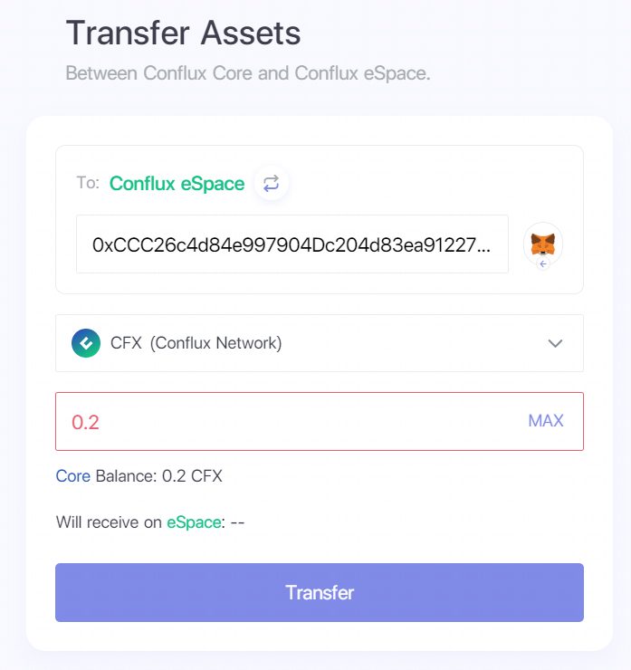

- 点击Transfer按钮，Fluent的合约交互接口将自动弹出，如下图所示：
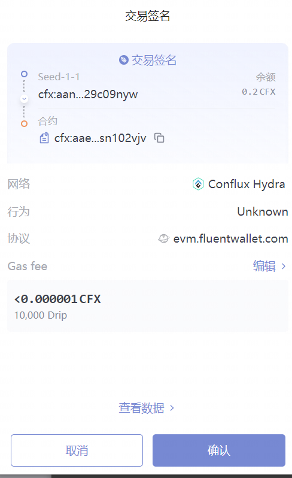

- 点击上图中对应的确认按钮，进行跨空间交互，当页面提示下图信息时，代表转移成功

- 用户可以使用任意支持Conflux espace的钱包查看账户余额，用户可参考[在知名钱包中添加Conflux espace教程](https://conflux-wiki.github.io/conflux-wiki/development/espace-wallet/)在知名钱包中添加Conflux espace的RPC网络服务。
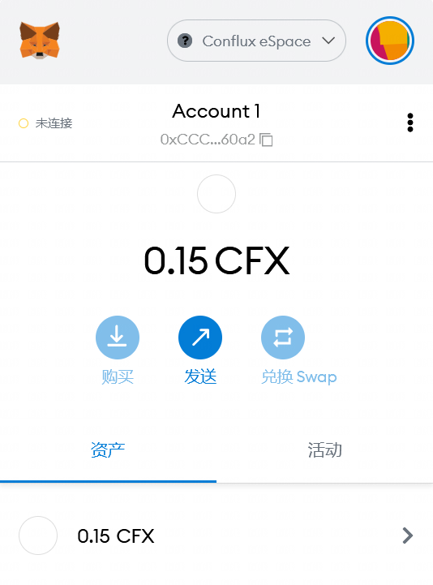

## 从espace网络跨ecfx到Conflux原生网络

参考[链接](https://forum.conflux.fun/t/space-cfx-crc20/13429)即可，方法类似。

## 从Conflux网络跨cusdt到espace

- 访问[eSpace Bridge跨链工具](https://confluxhub.io/espace-bridge/cross-space)，点击切换按钮，选择**To Conflux eSpace**，示意图如下所示。
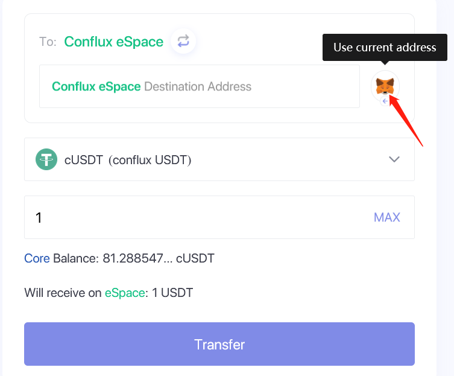

- 点击小狐狸按钮，获取当前metamask选择的espace钱包地址，也可以通过剪贴板指定任意跨出地址（注意检查）
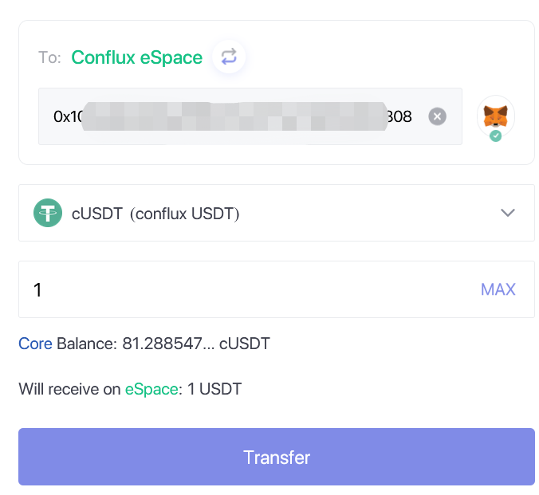

- 点击Transfer按钮，在弹出的Fluent钱包签名处确认交易即可跨出cusdt到espace形成usdt
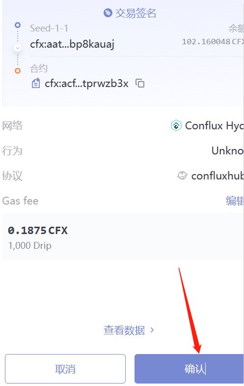

## 从Conflux的espace跨usdt到corespace获得cusdt

- 访问 [eSpace Bridge跨链工具](https://confluxhub.io/espace-bridge/cross-space)，点击切换按钮，选择**To Conflux Core**，示意图如下所示。
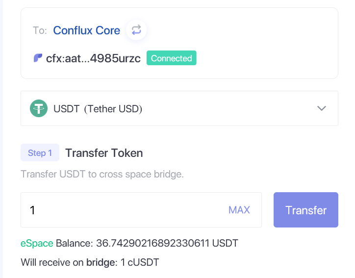

- 填写从espace跨入corespace的usdt数量，以1usdt为例，点击Transfer按钮，在Metamask处确认交易
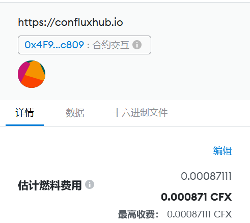

- 待交易确认后，向下查看页面Step2，点击Withdraw按钮，提取cusdt到corespace钱包中
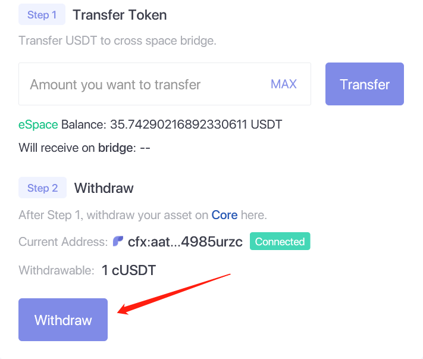

- 在fluent钱包中确认withdraw交易，如下图所示
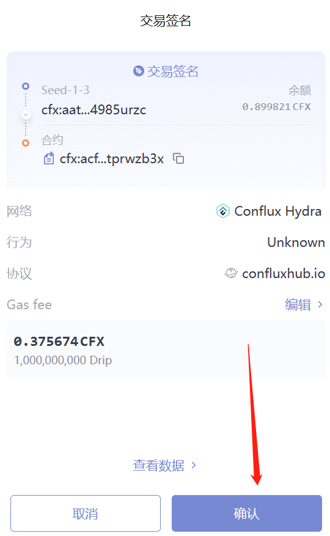

- 此时可以在fluent钱包中查看到cusdt
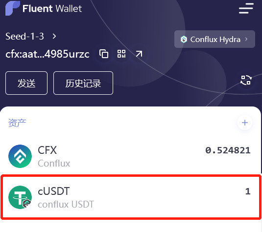

