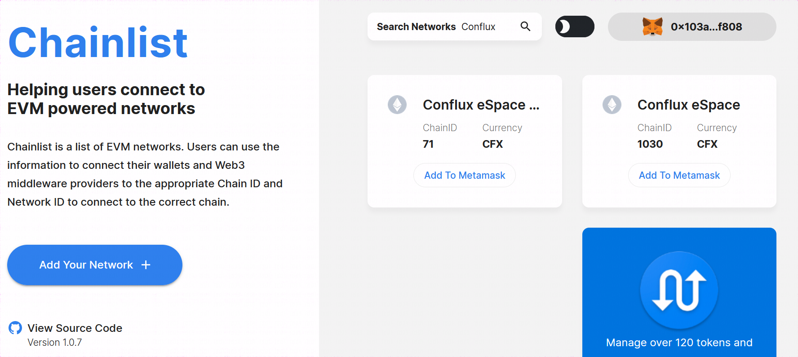
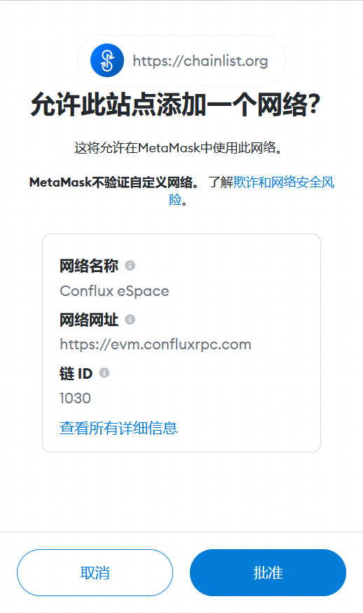
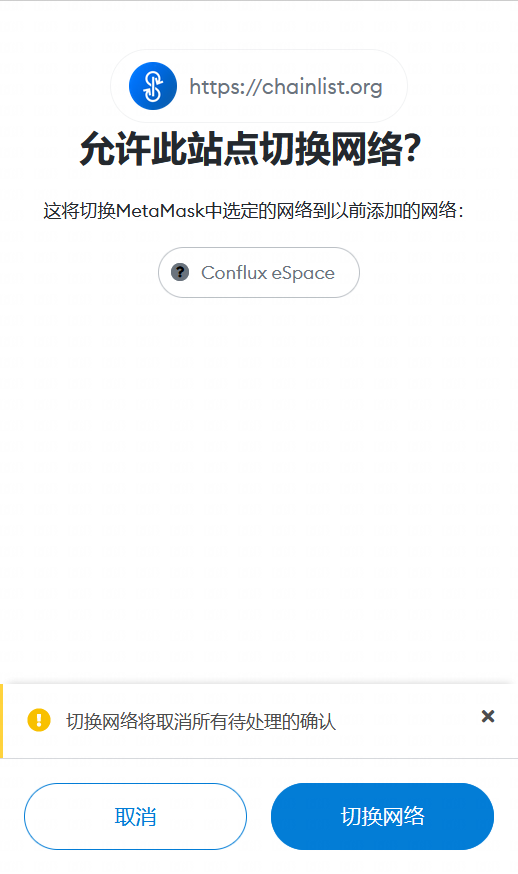
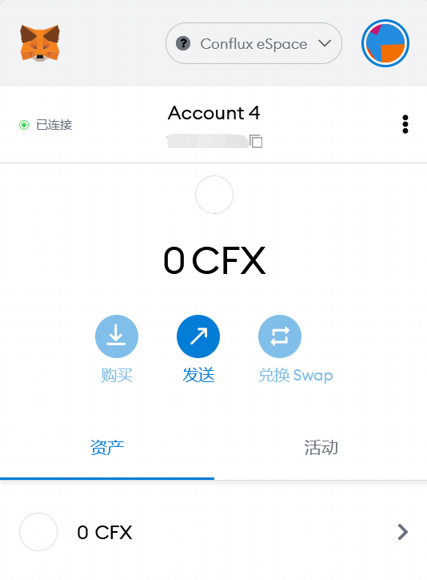

# 如何通过知名钱包使用Conflux eSpace

通过添加完全兼容EVM的Conflux eSpace RPC，能够帮助用户在大多数知名钱包中使用并享受Conflux网络带来的便捷。本案例将给出将RPC添加到TokenPocket，Imtoken或Metamask的方法。

## 如何通过 Metamask 使用 Conflux eSpace
- 访问[Chainlist主页](https://chainlist.org/)，使用Metamask连接钱包，并在页面中搜索Conflux

- 选择ChainID为1030的链，点击“Add To MetaMask”按钮，此时会弹出一条Metamask交互请求，您需要批准这一请求（无害）

- 此时页面会请求您切换网络，同意即可

- 切换成功

## 如何通过 TokenPocket 使用 Conflux eSpace

- 添加教程见[如何通过 TokenPocket 使用 Conflux eSpace](https://forum.conflux.fun/t/tokenpocket-conflux-espace/13807)

## 如何通过 Imtoken 使用 Conflux eSpace

- 添加教程见[如何通过 imToken 使用 Conflux eSpace](https://forum.conflux.fun/t/imtoken-conflux-espace/13808)
