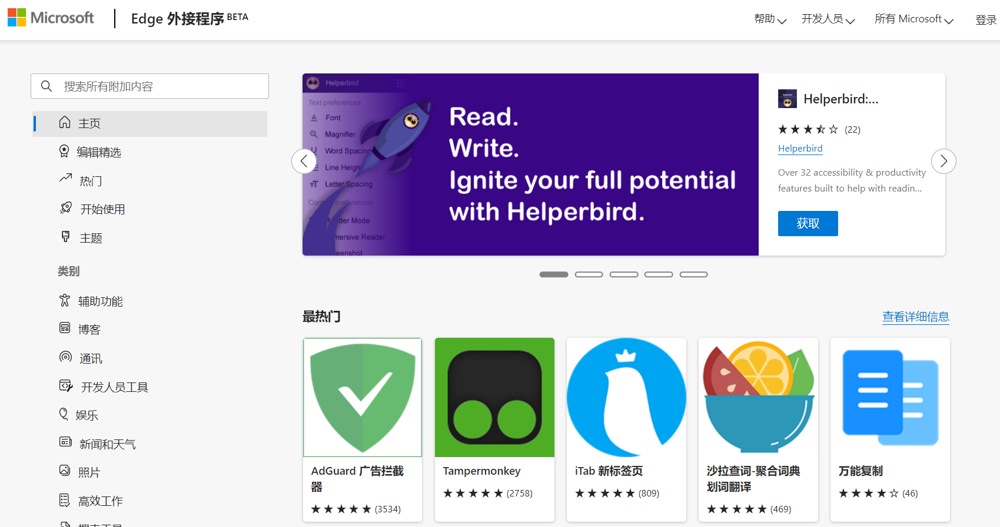
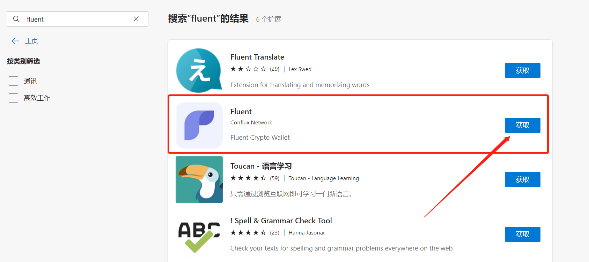
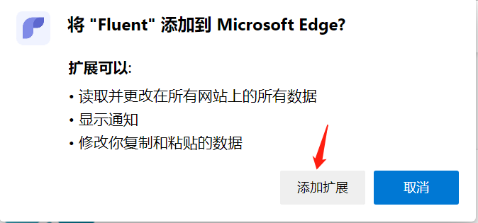
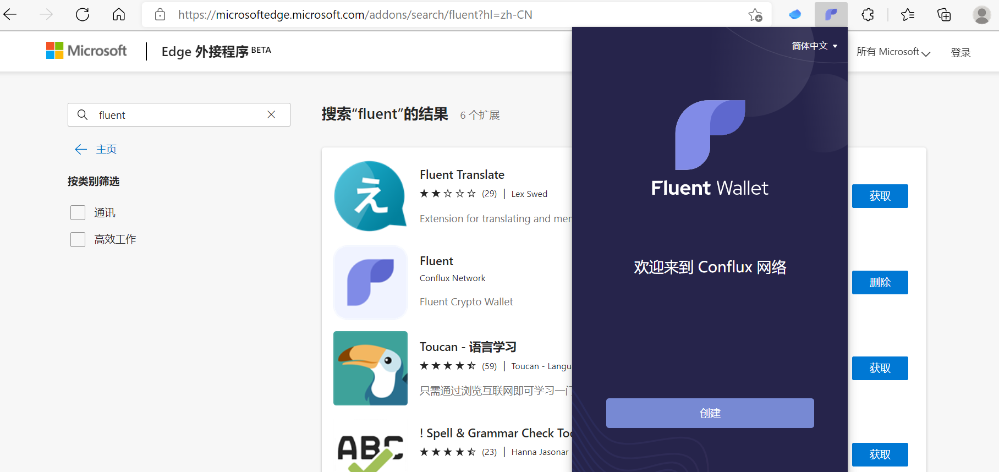
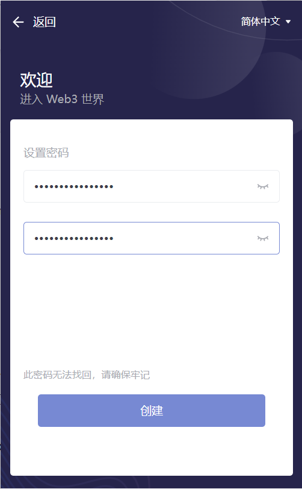
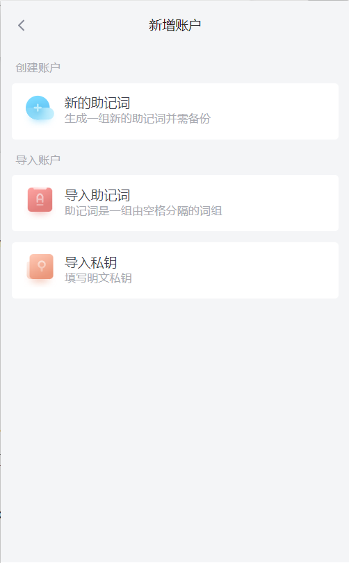
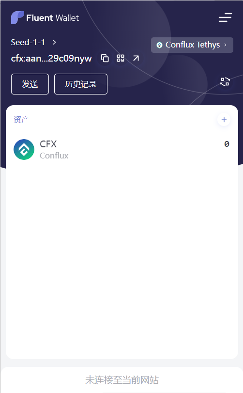

# Fluent钱包安装配置步骤

考虑到部分同志FQ难的问题，特使用Edge浏览器给各位观众老爷们进行展示

## 使用Edge安装Fluent钱包

- 使用edge访问[微软应用商店](https://microsoftedge.microsoft.com/addons?hl=zh-CN)
	

- 搜索“fluent”关键字

   

- 点击“获取按钮”在弹出窗口中点击“添加扩展”

   

- 通过Edge右上角侧边栏即可访问Fluent钱包

   

- 点击Fluent钱包内的“创建”按钮，并设置解锁密码

   

- 待密码设置完毕后，点击“创建”按钮

   

- Fluent目前支持通过三种方式获取一个Conflux网络钱包地址，分别是“使用新助记词生成”、“导入已有助记词”、“导入私钥”三种

  

## 如何确定我使用哪种方式导入钱包

1. 如果您是Conflux网络的新用户，**请使用“创建账户”功能中的->“新的助记词”功能**，生成一组新的助记词。注意，您需要备份您的助记词到一个安全且他人不可见的位置，以确保您的账户安全。

2. 如果您曾经使用Conflux Portal创建过钱包（可参考[教程](https://conflux-wiki.github.io/conflux-wiki/development/portal/#portal_1)中备份的助记词），**请使用“导入账户”功能中的->“导入助记词”方法**将在创建Portal钱包时备份的助记词导入Fluent。

3. 如果您仍然持有keystore形式的钱包，可以通过使用Portal的私钥导出功能，备份keystore形式地址的明文私钥，并使用Fluent提供的“导入私钥”功能恢复keystore钱包所对应的账户。

## 以创建账户为例

- 点击“新的助记词”按钮

	

- 点击下一步，并备份助记词
	
    
    
- 助记词记录在安全的位置后，点击下一步，并验证助记词顺序
 	
    
    
- 待验证成功后点击“创建”按钮
	

