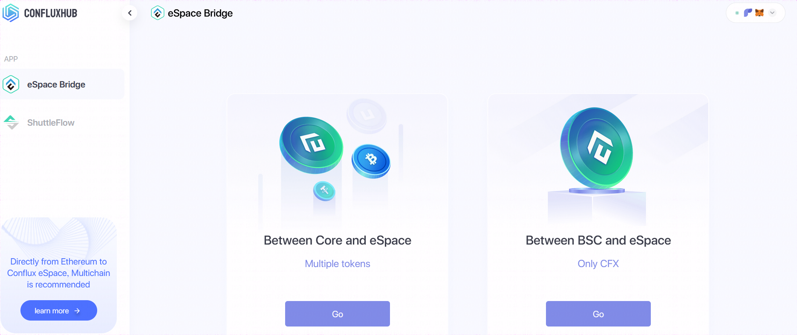

# Corespace 与 espace 跨空间

## 教程
为方便用户将 Corespace 中的资产快捷的进入 espace 参与如 [Swappi DEX生态](https://conflux-wiki.github.io/conflux-wiki/ecosystem/swappi/)，官方提供了跨空间解决方案

## 生态链接

- [ConfluxHub-eSpace Bridge](https://confluxhub.io/espace-bridge)

## 生态截图

- Between Core and eSpace：帮助用户完成 Core 与 eSpace 资产互跨的功能，[教程](https://conflux-wiki.github.io/conflux-wiki/development/cross-espace/)
- Between BSC and eSpace：帮助用户将 BSC 上的 bcfx 直接跨入 espace

