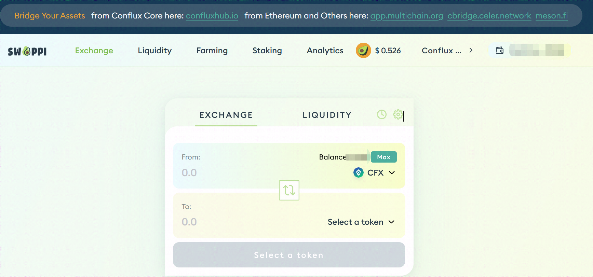
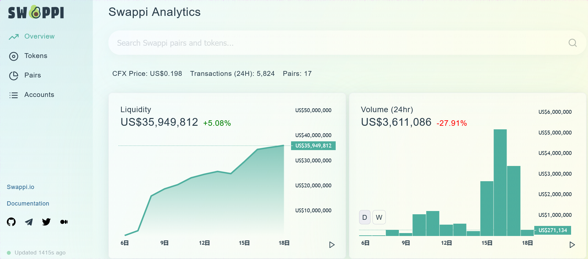

# Swappi

Conflux espace 上的首个 DEX 生态，参与 Swappi 需要在 Metamask 中配置 Conflux espace 网络 RPC，[在 Metamask 钱包配置 espace 方法](https://conflux-wiki.github.io/conflux-wiki/development/espace-wallet/#metamask-conflux-espace)。

## 生态链接

- [Swappi](https://app.swappi.io/)

## 生态截图

## 使用教程

- [Swappi DEX 使用说明及教程](https://forum.conflux.fun/t/swappidex/14693)

## 数据分析模块使用教程

在生态截图中我们能够看到Swappi提供了 [Analytics 模块](https://info.swappi.io/)，可以帮助用户对目前 DEX 中的代币及 token pair 及地址信息进行分析。

- Overview：提供 Swappi 平台流动性，交易量，交易对数目等数据统计信息
- Tokens：代币统计信息，价格，流动性，交易量等统计信息
- Pairs：显示平台目前的所有交易对
- Accounts：用户可以通过在搜索框键入目标地址的方法，针对当个账户交易数据进行分析

